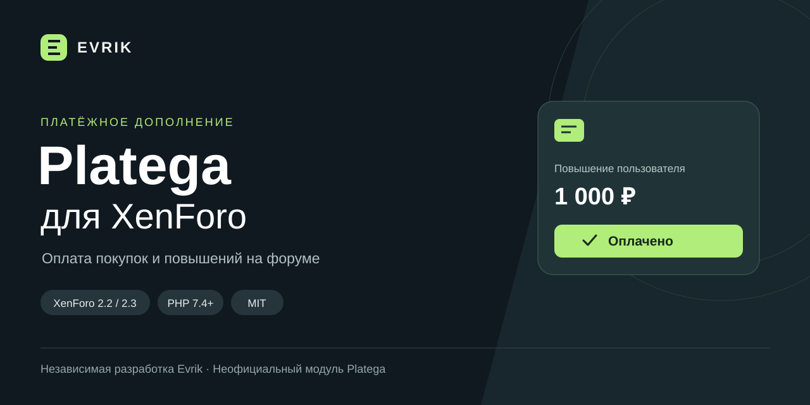

# Platega для XenForo

[](https://github.com/Evr1kys/xenforo-platega/actions/workflows/checks.yml)
[](https://github.com/Evr1kys/xenforo-platega/releases)
[](LICENSE)

Интеграция платёжного шлюза [Platega](https://platega.io) с XenForo 2.2 и 2.3. Поддерживает оплату повышений пользователей и покупок в дополнениях через стандартные платёжные профили XenForo.

**[Скачать](https://github.com/Evr1kys/xenforo-platega/releases) · [Установка](docs/INSTALL.md) · [Архитектура](docs/ARCHITECTURE.md) · [Проверки](docs/TESTING.md) · [Сообщить об ошибке](https://github.com/Evr1kys/xenforo-platega/issues)**

## Возможности

- Страница «Платежи Platega» в админке: список, поиск, фильтры по статусу и профилю, сводка и ручная обработка пропущенных уведомлений.
- Индексы журнала по дате, статусу и профилю для быстрой работы административного списка по мере роста истории.
- Быстрое заполнение формы ручной проверки из строки платежа.
- Проверка подключения с сохранёнными ключами без создания платежа.
- Выбор способа на странице Platega либо отдельный профиль для СБП, банковской карты, ЕРИП, международной оплаты, криптовалюты или SberPay.
- Разовые платежи в RUB, включая покупки с ограниченным сроком действия.
- Проверка ключа уведомления и повторная проверка транзакции через API.
- Сверка номера покупки, ID транзакции, суммы и валюты.
- Проверка ответа создания платежа: UUID транзакции, допустимый статус и безопасный HTTPS-адрес перенаправления.
- Защита от повторной обработки, в том числе при одновременных уведомлениях.
- Отмена выданной покупки после подтверждённого возврата `CHARGEBACKED`.
- Журнал в стандартном разделе платежей XenForo. Ключи и полные ответы API в него не записываются.
- Воспроизводимая сборка ZIP, проверка хешей содержимого и автоматическая публикация релизов при обновлении версии в main.

## Совместимость

Подробная [таблица проверенных версий и план расширения](docs/COMPATIBILITY.md).

| Компонент | Требование |
| --- | --- |
| XenForo | 2.2.0+; проверки на 2.2.19 и 2.3.6 описаны отдельно |
| PHP | 7.4+ и версия, поддерживаемая установленным XenForo |
| База | MySQL / MariaDB с InnoDB |
| Форум | Публичный HTTPS-адрес с действительным сертификатом |
| Platega | Merchant ID, Secret key и подключённые способы оплаты |

Дополнение использует общий интерфейс платёжных провайдеров XenForo 2.2/2.3. Для более новых версий совместимость требует отдельной проверки: верхнего ограничения в манифесте нет, но это не гарантия работы с будущими изменениями API XenForo.

Версия остаётся **beta**: автоматические и локальные проверки не заменяют контрольную оплату на вашем магазине Platega. Реальный платёж с ключами магазина перед публикацией не выполнялся.

## Быстрая установка

1. Скачайте `Evrik-Platega-1000033.zip` из релиза. Архивы GitHub **Source code** не предназначены для установки через панель.
2. В панели XenForo откройте **Дополнения → Установить/обновить из архива**. Если загрузка архивов отключена, перенесите содержимое `upload` в корень форума и установите дополнение из списка.
3. В **Настройки → Платёжные профили** создайте профиль **Platega**, укажите Merchant ID, Secret key и способ оплаты.
4. Скопируйте URL уведомлений из профиля в кабинет Platega: **Настройки → Callback URLs**.
5. Подключите профиль к нужному повышению пользователя или другому товару. Для повышения отключите автоматическое продление, валюта — `RUB`.

Подробности, проверка оплаты и разбор ошибок — в [инструкции](docs/INSTALL.md).

## Передаваемые данные

При создании платежа в Platega передаются описание покупки, сумма, валюта, ключ покупки, адреса возврата, ID пользователя, имя пользователя и его IP-адрес. IP добавляется только тогда, когда XenForo возвращает корректный адрес. Эти данные используются для проведения платежа, привязки результата к покупке и антифрод-проверки. Secret key и полные ответы API в журнал платежей не записываются.

## Ограничения

Автосписания, выплаты и создание возврата из панели XenForo в эту версию не входят. Возврат выполняется в Platega; дополнение обрабатывает его уведомление. Выдача и отзыв конкретного товара зависят от обработчика покупки XenForo или стороннего дополнения.

Если создание платежа завершилось с таймаутом, повторный запрос для той же покупки не отправляется: сначала нужно проверить результат в кабинете Platega. Подробнее — [восстановление после ошибки](docs/INSTALL.md#если-платёж-не-создался).

## Разработка

```sh
php tests/protocol.php
python3 scripts/check-package.py
python3 scripts/build.py
python3 scripts/check-archive.py
```

Готовый ZIP и SHA-256 появятся в `dist/`. Сборка воспроизводима: повторный запуск с тем же исходным деревом создаёт архив с тем же SHA-256. Для интеграционных проверок нужна собственная лицензированная копия XenForo: исходники движка и данные форума в репозиторий не входят. См. [TESTING.md](docs/TESTING.md).

После изменения версии дополнения в `main` workflow `Release` создаёт тег и предварительный релиз: исходники проверяются, архив собирается и загружается в GitHub Releases вместе с контрольной суммой.

## Лицензия

[MIT](LICENSE) · Автор: [Evrik](https://github.com/Evr1kys).

Проект не связан с компаниями Platega и XenForo.
